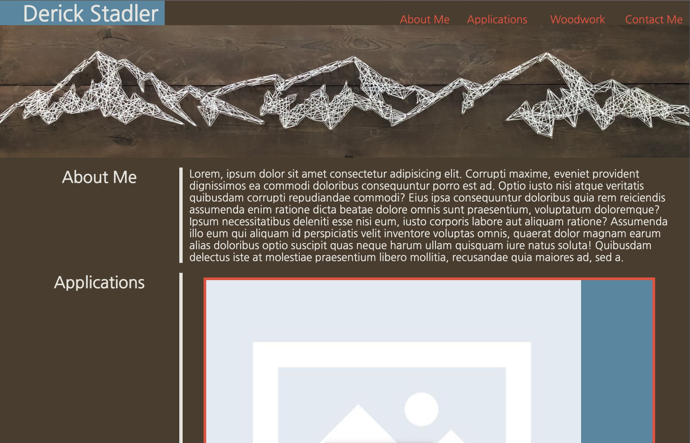

# First Portfolio Draft

## Building first portfolio page with HTML & CSS

## Notes & To Do

No current applications deployed. As I complete these they will be filled in and replace the current stock image fillers. They will also becoming properly linked with the image.

Adding more content including other work outside of coding applications to show well-roundedness. 

Developing more skill with media queries and CSS in general

### Learned

How to properly utilize the elements portion in the devtools to trial and error faster for proper looks. 

## Installation 

N/A

## Screenshot

## Link to Deployed Application

